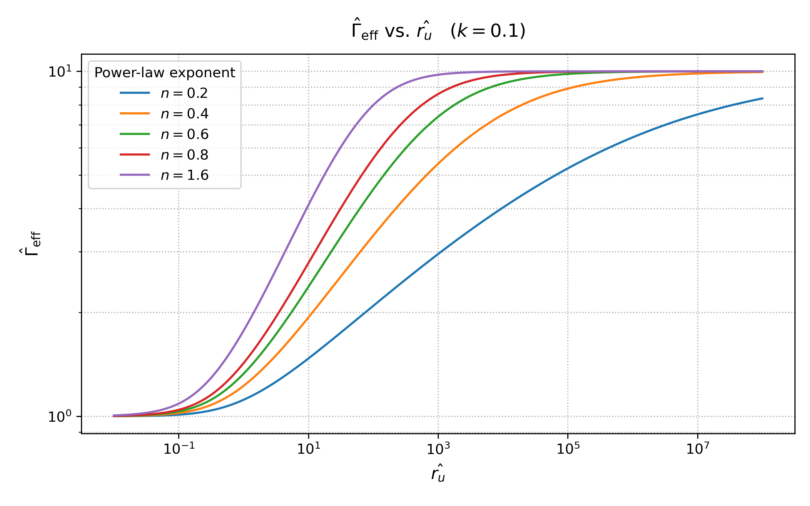

# Modified Power Law Viscoelastic Model: Effective Surface Energy

This repository provides a Python implementation to compute and visualize the **dimensionless effective surface energy** \(\hat{\Gamma}_{\mathrm{eff}}\) for a **viscoelastic material** modeled using the **Modified Power Law (MPL)** (
ML WILLIAMS, AIAA journal, 1964) framework through the Persson and Brener theory (BNJ Persson, EA Brener, Physical Review E, 2005). It is based on the analytical model introduced in:

Note: the model covers viscoelastic broad band behavior and it also covers Standard Linear Solid (SLS) model through n=1.6. 

> **Maghami, A., et al.**  
> *"Bulk and fracture process zone contribution to the rate-dependent adhesion amplification in viscoelastic broad-band materials."*  
> *Journal of the Mechanics and Physics of Solids*, Vol. 193, 2024, 105844.  
> [https://doi.org/10.1016/j.jmps.2024.105844](https://doi.org/10.1016/j.jmps.2024.105844)

---

## 📌 Description

The code solves an **implicit fixed-point equation** for \(\hat{\Gamma}_{\mathrm{eff}}\), derived in Eq. (B.1) of the paper, and evaluates a **closed-form expression** for the associated integral given in Eqs. (B.2–B.3), involving **hypergeometric functions**.

The resulting plot displays how \(\hat{\Gamma}_{\mathrm{eff}}\) varies with the dimensionless rate parameter \(\hat{\nu}\), for various values of the **MPL power-law exponent** \(n\).

---

## 📈 Example Output

<p align="center">
  
</p>

---

## 📂 File Structure

```
.
├── mpl_gamma_eff_plot.py       # Main script to compute and plot Gamma_eff vs nu
├── example_plot.png            # Sample output image
└── README.md                   # You're here!
```

---

## 🧠 Dependencies

The code requires:

- Python 3.8+
- NumPy
- matplotlib
- mpmath (for arbitrary-precision special functions)

Install them via pip:

```bash
pip install numpy matplotlib mpmath
```

---

## 🚀 How to Use

Clone the repository:

```bash
git clone https://github.com/<your-username>/mpl-viscoelastic-adhesion.git
cd mpl-viscoelastic-adhesion
```

Run the main script:

```bash
python mpl_gamma_eff_plot.py
```

The plot will display \(\hat{\Gamma}_{\mathrm{eff}}\) vs \(\hat{\nu}\) for several values of \(n\).

---

## 🔧 Customization

You can adjust the following in `mpl_gamma_eff_plot.py`:

```python
k = 0.10                            # Surface energy ratio
n_list = [0.2, 0.4, 0.6, 0.8, 1.6]  # Power-law exponents to compare
nu_min, nu_max = 1e-2, 1e8         # Range for dimensionless rate \hat{\nu}
num_points = 200                   # Number of samples per curve
```

---

## 📝 License

This project is licensed under the **MIT License**.  
See the [`LICENSE`](./LICENSE) file for details.
